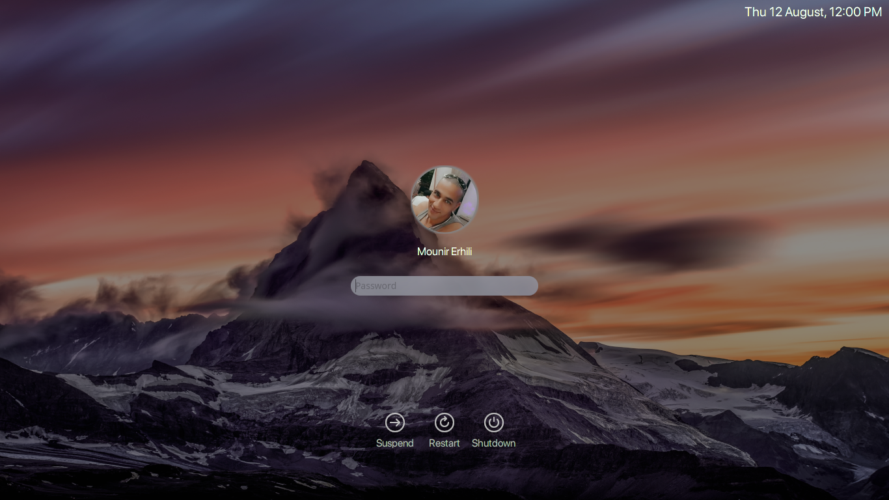

# ME login theme for KDE Plasma

ME is hot, just like a real chili! Spice up the login experience for your users, your family and yourself. ME reduces all the clutter and leaves you with a clean, easy to use, login interface with a modern yet classy touch.

ME for [KDE Plasma](https://www.kde.org/plasma-desktop) is the desktop environment *specific* version with *enhanced functionality* . If you don't use Plasma as your desktop environment you would likely prefer [Chili for SDDM](https://github.com/MarianArlt/sddm-chili).

## Prerequisites
* KDE Plasma 5
* SDDM

## Requirements
1) install `sddm-kcm` package
    * Archlinux
      ```
      $ sudo pacman -Syy --noconfirm sddm-kcm
      ```
    * debian | ubuntu | linuxmint | popos...
      ```
      $ sudo apt install -yy sddm-kcm
      ```
2) install [San Francisco Pro](https://github.com/MounirErhili/SF-Pro-Fonts) fonts

## Downloading the theme
* [Download the zip archive](https://github.com/MounirErhili/sddm-plasma-ME/archive/refs/heads/master.zip)
    ```
    $ 7z x sddm-plasma-ME-master.zip && cd sddm-plasma-ME-master
    ```
* or cloned via (git) command
    ```
    $ git clone https://github.com/MounirErhili/sddm-plasma-ME.git && cd sddm-plasma-ME
    ```

## Installing the theme
```
$ sudo chmod a+x install.sh && sudo ./install.sh
```

## Theming the theme
ME is now **even more** customizable through its `theme.conf` file. You can alter the intensity of the background blur or even not have any blur at all! Have a custom password field to your likings! Also there may be screens so big that the avatar just not looks correct. Change it in the config to something that better suits your screen!

  * Change the path of the background image relative to the themes directory:
    * `Background=components/artwork/background.jpg`
  * Set the real screen size if anything looks odd:
    * `ScreenWidth=1366`
    * `ScreenHeight=768`
  * Enable blur or play around with its intensity:
    * `Blur=false`
    * `RecursiveBlurLoops=40`
    * `RecursiveBlurRadius=4`
  * Customize the password input field:
    * `HidePasswordRevealIcon=true`
    * `PasswordFieldOutlined=false`
    * `PasswordFieldCharacter=`
    * `## The character shown when your password is hidden. Here are some funny ones you can copy: ⁙ ⁕ ○ █ ©`
    * `PasswordFieldPlaceholderText=Password`
  * Customize the Avatar Color and/or sizes:
    * `AvatarOutline=false`
    * `AvatarPixelSize=110`
    * `AvatarOutlineWidth=1`
    * `UsePngInsteadOfMask=false`
    * `AvatarOutlineColor="#ffffff"`
  * Adjust Fonts:
    * `Font="Z003"`
    * `clockFont="SF Pro Display"`
    * `batteryFont="SF Pro Display"`
  * Adjust sizes of the themes components (Dangerous! Integers without unit!):
    * `PowerIconSize=48`
    * `FontPointSize=12`
    * `clockFontPointSize=10`
    * `batteryFontPointSize=10`
  * Don't rely on a circle for your avatar. Instead use a png with transparency as your .face file:
    * `UsePngInsteadOfMask=false`

  * Translate the power buttons if your language isn't available by default:
    * `TranslationSuspend=`
    * `TranslationReboot=`
    * `TranslationPowerOff=`

You might see some grey pixels around your user image which is caused by the anti-aliasing of the opacity mask. You may change the fill color of the mask that resides in `components/artwork/mask.svg` to a color that better matches with your user images colors. Do **not** change the *opacity* of the mask. Take note that this might affect other user images with different colors present on your system. As of version 0.5.3 you can also use a PNG file with transparency instead. To do so set the before mentioned option.

## License
This project is licensed under the GPLv3 License - see the [LICENSE](LICENSE.md) for details

## Acknowledgments
Original code is taken from KDE plasma breeze theme. In specific the SDDM login theme written by [David Edmundson](davidedmundson@kde.org).

## Coffee
In the past years I have spent quite some hours on open source projects. If you are the type of person who digs attention to detail, know how much work is involved in it and/or simply likes to support makers with a coffee or a beer I would greatly appreciate your donation on my [PayPayl](https://www.paypal.me/MounirErhili) account.
